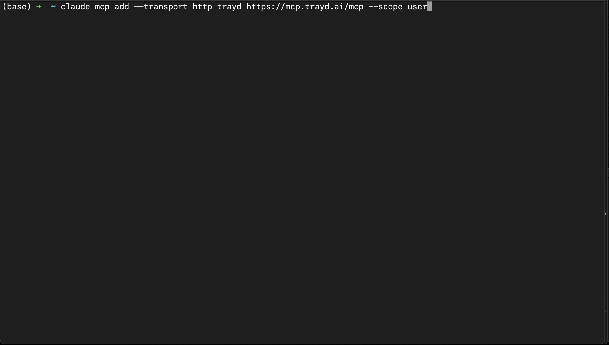

# Trayd - Trade Robinhood with Natural Language in Claude Code

Connect Claude Code to your Robinhood account. Analyze your portfolio, get real-time quotes, and execute trades—all through conversation.




## Quick Start

```bash
claude mcp add --transport http trayd https://mcp.trayd.ai/mcp --scope user
```

Then in Claude Code:
1. Type `/mcp` → select `trayd` → click **Authorize**
2. Sign in with Google
3. Say: *"Link my Robinhood account"*
4. Approve on your phone
5. Start trading!

## What You Can Do

### 📊 Portfolio Analysis
```
"What's my portfolio worth?"
"Show my positions with P&L"
"What's my biggest winner today?"
"How much cash do I have available?"
```

### 📈 Real-Time Market Data
```
"What's NVDA trading at?"
"Get me a quote on AAPL"
"Check the price of TSLA"
```

### 💰 Trade Execution
```
"Buy 10 shares of AAPL"
"Sell 5 shares of GOOGL"
"Place a limit order for TSLA at $400"
"Buy 100 shares of SPY at $590"
```

### 📋 Order Management
```
"Show my open orders"
"Cancel my AAPL order"
"Cancel all pending orders"
```

> **Note:** Market orders work during regular hours (9:30 AM - 4 PM ET). Extended hours (pre-market & after-hours) require limit orders—this is a Robinhood policy.

## Features

### Portfolio Intelligence
- **Portfolio Summary** - Total equity, cash balance, buying power
- **Position Details** - Every holding with quantity, avg cost, current value, P&L
- **Real-Time Quotes** - Bid/ask, volume, day range for any ticker
- **Order Tracking** - All open and pending orders

### Trade Execution
- **Market Orders** - Buy/sell at current market price
- **Limit Orders** - Set your exact entry/exit price
- **Fractional Shares** - Trade any dollar amount
- **Order Cancellation** - Cancel any open order instantly

### Why Natural Language?
Instead of clicking through multiple screens:
```
Old way: Open app → Search ticker → Click buy → Enter shares → Review → Confirm → Done
Trayd:   "Buy 10 AAPL" → Confirm → Done
```

## Security Model

### How Your Credentials Flow

```
You → Claude Code → Trayd Server → Robinhood API
         ↓              ↓
    (MCP token)    (Your RH credentials
                   passed through to RH,
                   NEVER stored by us)
```

**Important to understand:**
- Your Robinhood email/password pass through our server to Robinhood's API
- We **never log, store, or persist** your password - it goes directly to Robinhood
- After login, Robinhood returns access tokens which we hold **in memory only**
- Tokens are wiped on: logout, server restart, or container redeployment

### What We Store (and Don't)

| Data | Stored? | Where | Duration |
|------|---------|-------|----------|
| Robinhood password | **NO** | Never touches disk | Passed through, then discarded |
| Robinhood access token | Yes | Server memory only | Until logout/restart |
| Your trades/positions | **NO** | Not logged | Fetched live from RH |
| Your Google identity | Yes | Via Clerk | For auth only |

### Authentication
- **OAuth 2.1 with PKCE** - Industry-standard secure auth flow
- **Google Sign-in via Clerk** - We don't handle Google passwords
- **Robinhood Phone 2FA** - Native Robinhood security, you approve on your phone

### Infrastructure
- **AWS ECS Fargate** - Containerized, isolated execution
- **Cloudflare Tunnel** - DDoS protection, no exposed ports
- **HTTPS everywhere** - All traffic encrypted

## Available Tools

| Tool | What It Does | Example |
|------|--------------|---------|
| `get_portfolio` | Portfolio value, cash, buying power | *"What's my portfolio worth?"* |
| `get_positions` | All holdings with cost basis & P&L | *"Show my positions"* |
| `get_quote` | Full quote with bid/ask/volume | *"Get a quote on NVDA"* |
| `get_price` | Quick price check | *"What's AAPL at?"* |
| `get_open_orders` | Pending orders | *"Any open orders?"* |
| `place_order` | Buy/sell (market or limit) | *"Buy 10 TSLA at $400"* |
| `cancel_order` | Cancel an order | *"Cancel my TSLA order"* |
| `check_login_status` | Check if Robinhood linked | *"Am I connected?"* |
| `link_robinhood` | Connect Robinhood account | *"Link my Robinhood"* |
| `logout` | Disconnect & wipe tokens | *"Disconnect Robinhood"* |

## Example Conversations

### Check Your Portfolio
```
You: What's my portfolio worth?

Claude: Your Robinhood portfolio:
  • Total Equity: $45,230.82
  • Cash Available: $2,156.33
  • Buying Power: $2,156.33
```

### View Positions
```
You: Show my positions

Claude: Your current holdings:

  NVDA - 50 shares
  • Avg Cost: $127.45 → Current: $137.01
  • Market Value: $6,850.50
  • P&L: +$478.00 (+7.5%)

  AAPL - 100 shares
  • Avg Cost: $178.23 → Current: $254.49
  • Market Value: $25,449.00
  • P&L: +$7,626.00 (+42.8%)
```

### Get a Quote
```
You: What's TSLA trading at?

Claude: TSLA (Tesla Inc) - $421.06
  • Bid: $421.05 × 100
  • Ask: $421.08 × 200
  • Day Range: $415.02 - $428.50
  • Volume: 42.3M
```

### Place a Trade
```
You: Buy 5 shares of GOOGL at $191

Claude: I'll place a limit order to buy 5 shares of GOOGL at $191.00.

  [Calls place_order tool]

  ✓ Limit order placed successfully
  • Order ID: 67890-abcdef
  • Buy 5 GOOGL @ $191.00 limit
```

### Cancel an Order
```
You: Cancel my GOOGL order

Claude: [Calls cancel_order tool]

  ✓ Order cancelled successfully
```

## Troubleshooting

| Issue | Solution |
|-------|----------|
| Browser doesn't open for auth | Type `/mcp` → select `trayd` → click "Authorize" |
| Phone notification not received | Ensure Robinhood app is installed and you're logged in |
| "Authentication required" error | Run `/mcp` to re-authenticate |
| Market order rejected after hours | Use limit orders (Robinhood policy for extended hours) |

## FAQ

**Is this safe?**
We've designed this with security in mind: passwords pass through to Robinhood without storage, tokens exist only in memory, and you approve every login via phone. That said, you are trusting our server with temporary access to your brokerage. Review the [Security Model](#security-model) and decide if you're comfortable.

**Why should I trust you?**
Fair question. You can:
- Review how credentials flow (documented above)
- Logout anytime to wipe your token immediately
- Know that server restarts automatically wipe all tokens
- We're a small team building this openly—our reputation depends on doing this right

**Can I self-host this?**
Not yet, but we're considering it. If there's demand, we may open-source the server.

**Does this violate Robinhood's Terms of Service?**
This uses Robinhood's unofficial API (same as other third-party apps). While we haven't seen enforcement, use at your own discretion.

**Can I use this for day trading?**
Yes, but be aware of Robinhood's pattern day trader rules if you have under $25k equity.

**Does this work with Robinhood Gold?**
Yes, all Robinhood account types are supported.

**What happens if the server restarts?**
You'll need to re-link your Robinhood account. This is a security feature—tokens are never persisted to disk.

**What if something goes wrong with a trade?**
You are responsible for all trades placed through your account. We provide the interface; you make the decisions. Always verify orders before confirming.

## Risks & Disclaimers

**Please read before using:**

- **USE AT YOUR OWN RISK** - This software is provided "as is" without warranty
- **NOT FINANCIAL ADVICE** - We don't provide investment recommendations
- **YOU ARE RESPONSIBLE** - For all trades and decisions made through this tool
- **UNOFFICIAL API** - This uses Robinhood's unofficial API, not an official integration
- **NO LIABILITY** - We are not liable for any losses, bugs, or issues
- **BETA SOFTWARE** - This is early-stage software; expect rough edges

**By using Trayd, you acknowledge:**
1. You understand the security model and accept the risks
2. You are solely responsible for your trading decisions
3. You will not hold Trayd liable for any losses
4. You understand this is not affiliated with Robinhood

---

**Not affiliated with Robinhood Markets, Inc.**

**Not financial advice.** This tool helps you interact with your own brokerage account. All investment decisions are yours.

## Support

- Email: team@trayd.ai
- GitHub: [trayders/trayd-mcp](https://github.com/trayders/trayd-mcp/issues)

## License

MIT
