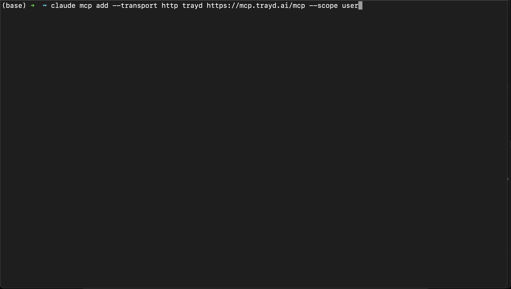

# Trayd

Trade Robinhood from Claude. Portfolio analysis, real-time quotes, and order execution through natural language.




## Setup

### Claude.ai (Web App)

1. Go to [claude.ai](https://claude.ai) > **Settings** > **Connectors**
2. Click **Add custom connector**
3. Name: `trayd` | URL: `https://mcp.trayd.ai/mcp`
4. Click **Add** > **Connect** > sign in
5. Set "Other tools" to **Always allow** for the best experience
6. Say: *"Link my Robinhood account"*

### Claude Code (Terminal)

```bash
claude mcp add --transport http trayd https://mcp.trayd.ai/mcp --scope user
```

Type `/mcp` > select `trayd` > **Authorize** > sign in > *"Link my Robinhood account"*

Both connect to the same account. Use whichever you prefer.

## What It Does

| Capability | Example |
|-----------|---------|
| Portfolio analysis | "What's my portfolio worth?" |
| Real-time quotes | "What's NVDA trading at?" |
| Buy and sell | "Buy 10 shares of AAPL at market" |
| Limit orders | "Place a limit order for TSLA at $400" |
| Ladder orders | "Set 5 ladder buys for NVDA from $180 to $175" |
| Multi-account | "List my accounts" / "Switch to my second account" |
| Batch operations | "Buy $500 worth of each: AAPL, GOOGL, MSFT" |
| Cancel orders | "Cancel all my open orders" |

All limit orders default to 24-hour extended trading. Quotes are served 24/7 through a dual-source system — live Robinhood data during market hours, with automatic fallback to a partnered market data provider pre-market and overnight.

### Why This Exists

Setting 5 ladder limit orders on Robinhood takes 50+ clicks and 5 minutes.

With Trayd: *"Set 5 ladder buys for NVDA from $180 to $175"* — one sentence, 10 seconds.

## Running a Trading Bot

Claude Code's `/loop` command turns Trayd into an always-on trading agent:

```
"Check my positions every 5 minutes. If anything drops 3%, sell it."
"Monitor NVDA. If it hits $130, buy 20 shares."
"Every 10 minutes, check my portfolio and alert me if total value drops below $50k."
```

No code. No scripts. Just natural language rules that Claude executes on a schedule.

## Security

```
You > Claude > Trayd Server > Robinhood API
```

- Robinhood credentials are passed directly to Robinhood's API — **never stored**
- Access tokens held in memory only — wiped on logout, restart, or redeployment
- OAuth 2.1 with PKCE for MCP authentication
- Robinhood phone 2FA on every login — you approve each session on your device
- Infrastructure: AWS ECS Fargate, Cloudflare Tunnel, HTTPS everywhere

| Data | Stored? | Details |
|------|---------|---------|
| Robinhood password | No | Passed through, immediately discarded |
| Access token | In memory | Wiped on logout or restart |
| Trades and positions | No | Fetched live from Robinhood |
| Google identity | Yes | Via Clerk, for auth only |

### Verify It Yourself

1. Ask Claude: *"Am I logged into Robinhood?"* — it will tell you honestly
2. Place a test order that won't execute: *"Limit buy 1 NVDA at $50"* — check your Robinhood app
3. Say *"Logout"* — tokens are wiped instantly. Ask Claude to confirm.

## Traction

- 50+ users, 60K+ orders served
- Active traders running automated strategies via `/loop`
- Used on both claude.ai and Claude Code

## Troubleshooting

| Issue | Fix |
|-------|-----|
| Auth not working | Type `/mcp` > select `trayd` > click **Authorize** |
| Phone notification missing | Make sure Robinhood app is installed and you're logged in |
| "Authentication required" | Re-run `/mcp` to refresh your token |
| Market order rejected after hours | Use limit orders — Robinhood policy |

## Disclaimer

This software is provided as-is. You are solely responsible for all trades placed through your account. Not financial advice. Not affiliated with Robinhood Markets, Inc.

## Support

Email: team@trayd.ai
Issues: [trayders/trayd-mcp](https://github.com/trayders/trayd-mcp/issues)

## License

MIT
